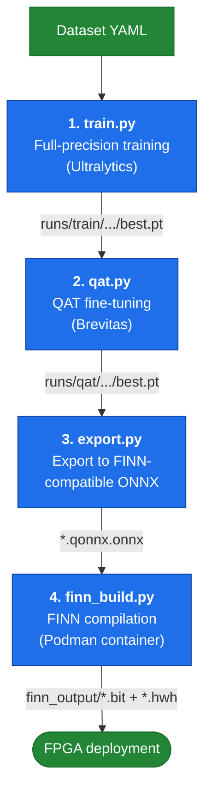

# Quantized YOLO with FINN

This repository provides an end-to-end pipeline for training a quantized YOLO object detection model using [Brevitas](https://github.com/Xilinx/brevitas) QAT and compiling it to FPGA hardware via [FINN](https://github.com/Xilinx/finn).

---

## Pipeline Overview



---

## Prerequisites

| Requirement | Notes |
|------------|-------|
| [devenv](https://devenv.sh) | Manages the Nix shell, the `uv`-backed Python 3.13 environment, and pipeline scripts |
| [Podman](https://podman.io) | Runs the FINN build container (Phase 4); this project targets rootless Podman |
| [Xilinx Vivado](https://www.xilinx.com/products/design-tools/vivado.html) | Required on the host for bitstream synthesis (Phase 5); mounted into the FINN container via `VIVADO_PATH` |
| GPU (optional) | A CUDA-capable GPU speeds up full-precision training and QAT; CPU works but is slow |

---

## Quick Start

### 1. Enter the development environment

```bash
devenv shell
```

For auto activation, enable the [shell integration](https://devenv.sh/auto-activation/) and then run `devenv allow` on this folder.

This activates the Python 3.13 virtual environment (managed by `uv`) with the current dependencies (`ultralytics`, `pydantic`, `pyyaml`, `brevitas`). ONNX and the FINN toolchain are added as their respective phases land.

### 2. Get the example dataset

```bash
download-data
```

This downloads the [Ships in Aerial Images](https://www.kaggle.com/datasets/siddharthkumarsah/ships-in-aerial-images) dataset and patches `data/ships-in-aerial-images/data.yaml` to use correct local paths.

You can use **any dataset** with the pipeline by providing a YOLO-format `data.yaml` (see [Ultralytics dataset docs](https://docs.ultralytics.com/datasets/detect/)).

### 3. Configure the pipeline

Edit the YAML files in `configs/` before running:

- **`configs/model.yaml`** — YOLO variant and quantization bit-widths
- **`configs/train.yaml`** — training epochs, batch size, device, QAT settings
- **`configs/finn.yaml`** — target FPGA, compilation depth (`stop_step`)

### 4. Train (full precision)

```bash
train --data data/ships-in-aerial-images/data.yaml
```

Trains the model configured in `configs/model.yaml` using Ultralytics. The checkpoint lands at `runs/train/<name>/weights/best.pt`.

### 5. Fine-tune with QAT

```bash
qat --weights runs/train/<name>/weights/best.pt --data data/ships-in-aerial-images/data.yaml
```

Continues training from the full-precision checkpoint with Brevitas quantization applied, so the network fine-tunes around the quantization error. The checkpoint lands at `runs/qat/<name>/weights/best.pt`.

---

## Technology Dictionary

- **YOLO (You Only Look Once)**: A popular object detection algorithm that processes images in a single pass, making it fast and efficient for real-time applications.
- **Quantization**: The process of reducing the precision of the numbers used to represent a model's parameters and activations, which can lead to smaller model sizes and faster inference times, especially on hardware with limited resources.
- **Brevitas**: A PyTorch library for neural network quantization, providing tools for both post-training quantization (PTQ) and quantization-aware training (QAT).
- **Post-Training Quantization (PTQ)**: A quantization technique that applies quantization to a pre-trained model without requiring additional training, making it a quick and easy way to reduce model size and improve inference speed.
- **Quantization-Aware Training (QAT)**: A quantization technique that simulates quantization during the training process, allowing the model to learn to compensate for the reduced precision and often achieve higher accuracy than PTQ.
- **FINN**: A framework developed by Xilinx for building and deploying quantized neural networks on FPGAs, enabling high performance and low latency for machine learning applications.
- **FPGA (Field-Programmable Gate Array)**: A type of integrated circuit that can be configured by the user after manufacturing, allowing for custom hardware implementations of algorithms and models.

---

## Contributing

Issues are tracked with [bd (beads)](https://github.com/steveyegge/beads), not markdown TODOs — see `AGENTS.md` for the full workflow (`bd ready`, `bd show <id>`, `bd close <id>`).

Tests run with `pytest` inside the `devenv shell` once the suite lands (`qyf-735.2.8`).

---

## Related Projects

- [Ultralytics YOLO](https://github.com/ultralytics/ultralytics): The Ultralytics YOLO repository, which provides the most up-to-date implementation of the YOLO (You Only Look Once) object detection model.
- [Brevitas](https://github.com/Xilinx/brevitas): A PyTorch library for neural network quantization, with support for both post-training quantization (PTQ) and quantization-aware training (QAT).
- [Low Precision YOLO](https://github.com/sefaburakokcu/quantized-yolov5): Training YOLO(v1, v3, v5) models using different quantization using Brevitas.
- [LPYOLO: Low Precision YOLO for Face Detection on FPGA](https://github.com/sefaburakokcu/finn-quantized-yolo): A project focused on deploying low precision YOLO models for face detection on FPGA using FINN.
- [POSEIDON](https://github.com/Kytech/POSEIDON-SAT): The POSEIDON-SAT dataset augmentation tool and associated evaluation code.
